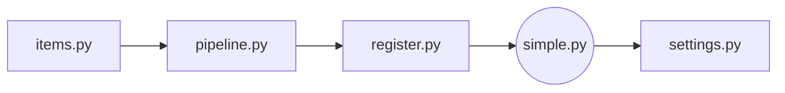

# 获取网课内容

## 背景

在大学里，有时你可能不得不学习一些在线课程来获得足够的学分，尽管你不喜欢它们。大多数时候，这件事真的很形式主义。此外，还有期末考试（幸运的是，开卷）供你准备。课程的所有内容都是视频，这意味着当你打开2倍速时，你仍然需要花很多时间来观看那些枯燥的视频，并且偶尔按暂停按钮记下一些笔记，当然只是为了应付考试。相信我，在这种情况下，你不会想学那些东西的。那是真的烦，不是吗？

因此，我想尽快把所有的课程内容都想办法抓下来，当作资料带去考场。

## 简介
我写了三个版本，源码已附上

|  Version  | Intro                                            |
| :-------: | :----------------------------------------------- |
| Version 1 | 轻量级、简洁; `selenium`                         |
| Version 2 | 比 Version 1 稍微复杂一点; `selenium` & `scrapy` |
| Version 3 | 封装成了 GUI ，稳定性稍微提高了一些              |

## 如何使用？

### Version 1

1. 你可以先打开 `full_code_screenshot.png` ，先有个总体的了解。
2. 看一下 `git_chapter.xlsx` ，里面有告诉你具体的操作。并且，那个地址就是打开 `final.xlsx` 的密码
3. 看看 `demo.ipynb` ，可以试一下代码能不能跑动
4. 接下来就可以看看我生成的 `final.xlsx`

### Version 2

1. 使用了 `scrapy` 框架，比较麻烦。

   - 最重要的是把 `spider `下的 `simple.py` 的逻辑想清楚
   - 自写了一个登录 `register.py`
   - 重写管道 `pipeline.py`, `items.py`
   - 设置了 `settings.py`，打开里面的部分开关
   - 中间件 `middlewares.py` 不用动
2. 建议新手看的顺序是

### Version 3

还在写

# Get Online Course Content

## Backgound

In college, sometimes you may have to take some online courses to get enough credits, even though you don't like them. Most of the time, this is really formalistic. In addition, there is a final exam (fortunately, open book) for you to prepare. All the contents of the course are videos, which means that when you open 2x speed, you still need to spend a lot of time watching those boring videos, and occasionally press the pause button to take notes, just to cope with the exam. Believe me, given the circumstance, you don't want to learn those things. That's really annoying :angry:, isn't it?
Therefore, I want to find a way to capture all the course contents as soon as possible and take them to the examination room as materials.

## Intro

There are three versions with codes.

|  Version  | Intro                                                        |
| :-------: | :----------------------------------------------------------- |
| Version 1 | lightweight and easy; `selenium`                             |
| Version 2 | slightly harder than Version 1; `selenium` & `scrapy`        |
| Version 3 | encapsulated into GUI and the overall stability has been slightly improved; |

## How to use them? 

### Version 1

1. you can open `full_code_screenshot.png` to have a general idea first.
2. Look at `git_chapter.xlsx`, which tells you exactly what to do. And, that address is the password to open `final.xlsx`.
3. Look at `demo.ipynb` and try to see if the code works.
4. next you can look at the `final.xlsx` I generated

### Version 2

1. Using `scrapy`, a little more complicated

   - The most important thing is to figure out the `simple.py`
   - I write `register.py` to log in.
   - Rewrite `pipeline.py` and `items.py`
   - Modify `settings.py`
   - No need to modify `middlewares.py`
2. If you are new to this field, I suggest you read my code in the order :arrow_down:

### Version 3

continue

